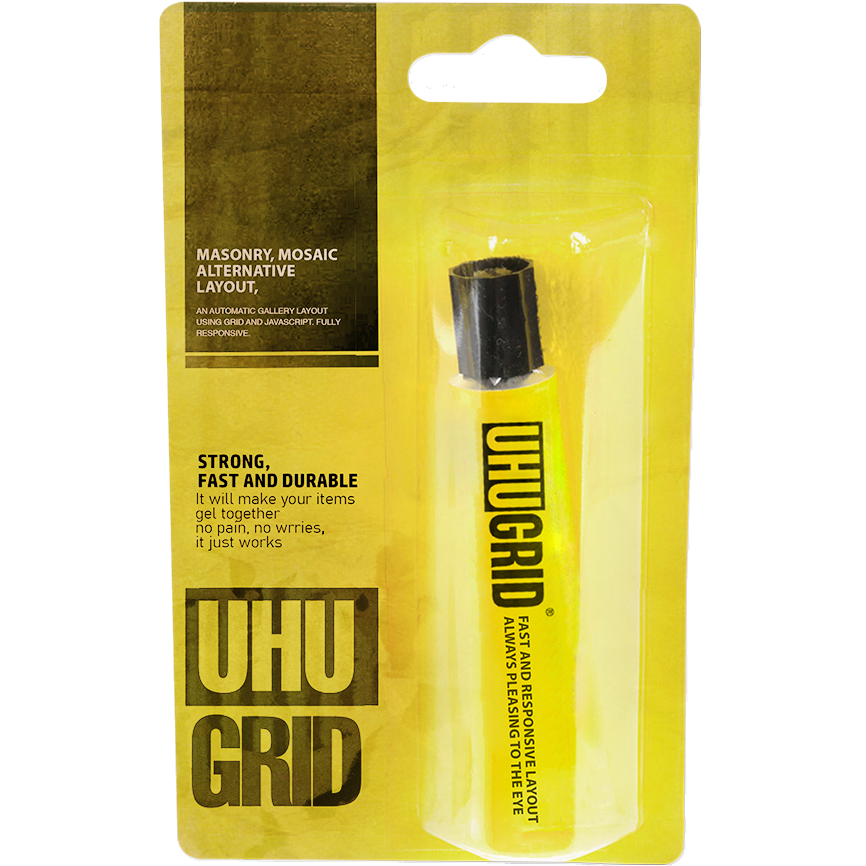

<br>


# UHU GRID
Creative layouts like Masonry (Pinterest style) and Mosaic are used all over the web.

**UHUGRID** will work as a better alternative if

+ Each card contains little to no inner content
+ The number of cards is dynamic, unknown or might change in the future
+ You want the layout to be future-proof, so you never worry about code.

<br>

Because of the above limitations, cards are not bound by their content dimension.
That's why it can do something none of the others could.
**It generates visually appealing cards**
by using aspect ratios suited best for the current screen size and
the available free space.

Unlike other solutions where the dimension of each card determined by its content,
UHUGrid has the luxury to generate what's aesthetic and good looking dimensions.

Named *UHU* because of its default behavior. *Glue all items together
and don't waste free space.*
Every time you refresh the page or request a layout change,
a new layout will be generated even if the screen size stays the same.

<br>

+ hardly doing any calculation, fast and snappy 
  no matter how many time a layout change is requested.

+ No media queries were used and the layout is fully responsive
  and it scales up to 4K displays or beyond.

+ the item's order will always stay the same as your
  HTML markup, unlike other solutions that uses
  `grid-auto-flow: dense` or `flex-box`.

<br>

# How to
Watch this walkthrough to understand some basics that might save you headaches later.

[Watch on YouTube](https://youtu.be/PT3ZhB4-Y40)

<br>

# Live demo
[Click here](https://cipherlogs.github.io/uhugrid/demo/)
to access a simple live example of **UHUGRID**.

<p align="center">
  
</p>

<br>

**PS:** the images that were used in the demo are low quality
images, they are just there for demonstration purposes.

<br>

# Install

### 1. CDN
Just inject it in you HTML markup and the rest will be taken care of!

```HTML
<script
  defer
  src = "https://cdn.jsdelivr.net/npm/uhugrid@1.0.1/plug.min.js"

>
</script>
```

<br>

### 2. NPM

```
$ npm install --save-dev uhugrid
```

```JavaScript
import {uhu} from "uhugrid";
```


<br>

# Usage
`.gallery` for the parent container
and `.gallery__item` for all its children.


```HTML
<div class="gallery">

  <div class="gallery__item">
    <!-- PLACE WHEREVER YOU WANT IN HERE -->
  </div>

</div>
```

The plugin only comes with the basic styling that are needed for
it to function properly. It is up to you to style `.gallery__item`
and its content the way want.

Overriding `.gallery` and `.gallery__item` is the correct way
the library was intended to be used.
Please watch the [**How to**](#how-to) video, to understand
some important details before you override any styles.


<br>

# API

The `uhu()` method controls the column size and the maximum height
for each row.

#### Syntax

> glue(column_size, maximum_row_height)


#### Paramaters

+ column_size **optional**: a range from 1 to 40,
  1 is approximately `100px`. If you insert `0` or `undefined`,
  **UHUGRID** will choose the best column size depending on
  the display width of the user.
  By default it can scale up to 4K displays.

+ maximum_row_height **optional**: for example if you insert 3,
  **UHUGRID** will randomly generate rows that are
  `100px`, `200px`, `300px` in height.
  If you insert 1, all rows will stay at `100px` height.
  `0` or `undefined` to let **UHUGRID** choose the most
  aesthetic height range related to column size.
  


```JavaScript
// everthing will be taken care of by default
uhu();

// all grid items will have the same height
// items width are always different and can't be controlled
uhu(1, 1);

// column width will be calculated according to the viewport width,
// and the row height is a range from 1 to 2
// it could be 100px height or 200px height
// items width as always will be generated randomly to
// aesthetically match the row height
uhu(0, 2)
```


<br>

# FAQ
Visit [FAQ.md](./FAQ.md) to read common questions and design
decisions.


<br>

# Changes

+ for upcoming changes take a look at the **Issues** tab.
+ visit [CHANGELOG.md](./CHANGELOG.md) for more information about
  each release.

<br>

# License
**UHUGRID** is released under the GPL-3.0 license.

